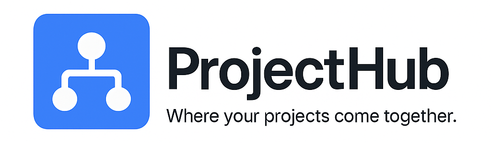
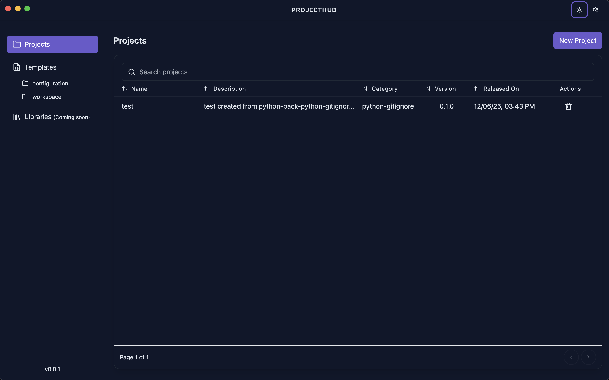

  
  <em> ProjectHub desktop app: install packs, choose templates and libraries, and spin up projects locally.</em>

 

 

[![Contributors][contributors-shield]][contributors-url]
[![Forks][forks-shield]][forks-url]
[![Stargazers][stars-shield]][stars-url]
[![Issues][issues-shield]][issues-url]
[![License][license-shield]][license-url]

## Get the App

  

- Download the latest release for your OS from GitHub Releases.
- Windows: run the installer `.exe`.
- macOS: open the `.dmg` and drag ProjectHub to Applications.
- Linux: run the `.AppImage` (make it executable if needed).

On first launch, ProjectHub sets up its data folder at `~/.projecthub`.

## Use ProjectHub
- Install packs from the **official marketplace** or add custom marketplaces
- Click **New Project**, choose templates and libraries, review, and create
- Use **AI Templates** to generate custom templates with natural language
- ProjectHub scaffolds the files/folders to your chosen destination

## AI Templates

Generate templates using AI—just describe what you need:

- **Multi-provider support** – Choose between Anthropic (Claude), OpenAI (GPT-4), or Ollama (local)
- **Chat-based** – Iteratively refine your template through conversation
- **Integrated** – Access AI from Templates or Libraries pages via the "Generate with AI" button
- **Secure** – API keys encrypted at rest, never exposed to the renderer process

First-time setup walks you through provider configuration. See **Settings → AI** to manage providers.

## Packs & Marketplaces

ProjectHub uses a **marketplace** system for distributing template packs:

- **Official Marketplace** – Built-in, includes `react-pack` and `python-pack`
- **Custom Marketplaces** – Add your team's or community pack sources via `owner/repo`

Click **Marketplace** in the sidebar to browse and install packs. Use **category filters** (Frontend, Backend, Fullstack, Configuration) to narrow results, and hover over the **info icon** on any pack card for details. Manage marketplace sources in **Settings → Marketplace**.

Browse the [ProjectHub Packs](https://github.com/cbabil/projecthub-packs) repository for available packs, or [create your own marketplace](https://github.com/cbabil/projecthub-packs/wiki/Authoring-a-pack#creating-your-own-marketplace).

## Documentation
- Browse the [Wiki](../../projecthub.wiki) for guides, flows, and troubleshooting.

## Contributing
- See [CONTRIBUTING.md](CONTRIBUTING.md) for dev setup and PR guidelines.
- Code of Conduct: [CODE_OF_CONDUCT.md](CODE_OF_CONDUCT.md)
- Security: [SECURITY.md](SECURITY.md)

## License
- MIT License (see [LICENSE](LICENSE)).

---
<!-- MARKDOWN REFERENCE LINKS -->
[contributors-shield]: https://img.shields.io/github/contributors/cbabil/projecthub.svg?style=for-the-badge
[contributors-url]: https://github.com/cbabil/projecthub/graphs/contributors
[forks-shield]: https://img.shields.io/github/forks/cbabil/projecthub.svg?style=for-the-badge
[forks-url]: https://github.com/cbabil/projecthub/network/members
[stars-shield]: https://img.shields.io/github/stars/cbabil/projecthub.svg?style=for-the-badge
[stars-url]: https://github.com/cbabil/projecthub/stargazers
[issues-shield]: https://img.shields.io/github/issues/cbabil/projecthub.svg?style=for-the-badge
[issues-url]: https://github.com/cbabil/projecthub/issues
[license-shield]: https://img.shields.io/github/license/cbabil/projecthub.svg?style=for-the-badge
[license-url]: https://github.com/cbabil/projecthub/blob/main/LICENSE
